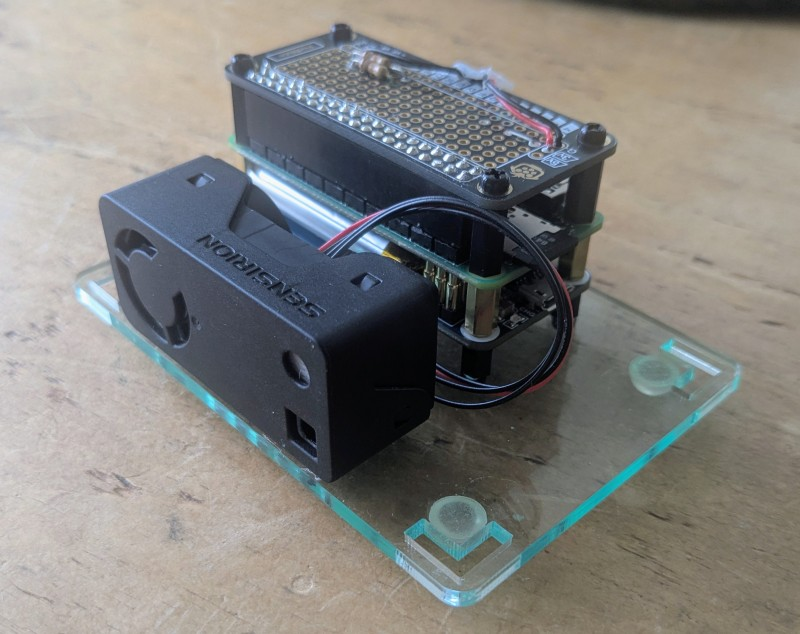
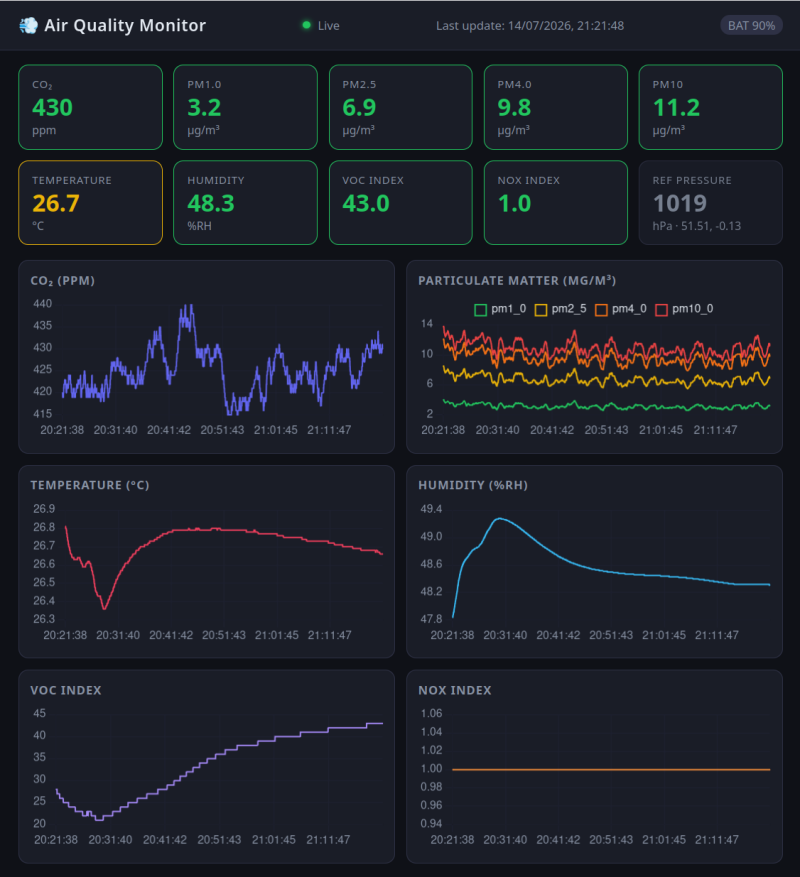
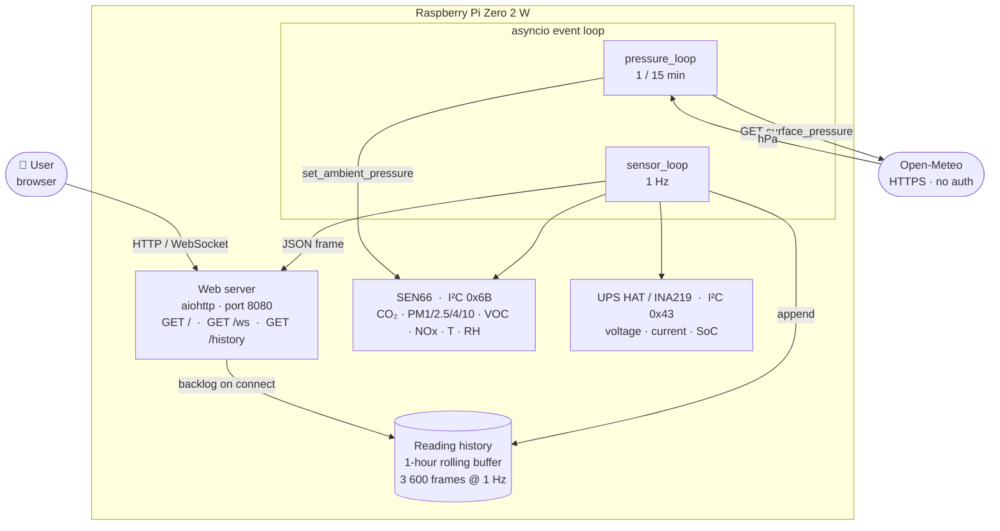

# Air Quality Monitor (AQM)

## Brief

A _utility_ project to monitor domestic/indoor air quality. The device functions as a web server. 
Builtin battery offers portability. Software was entirely vibe-coded over a weekend, but the code 
is minimal and readable.

**Hardware assembly** <br>


**Web browser interface** (`http://<ip-address>::8080`)<br>


## Components

| Component | Interface |
|---|---|
| Sensirion SEN66 (CO₂, PM, VOC, NOx, T, RH) [[info](https://sensirion.com/products/catalog/SEN66)] | I²C bus 1, addr 0x6B |
| Waveshare UPS HAT (C) [[info](https://www.waveshare.com/wiki/UPS_HAT_(C))] | I²C bus 1, addr 0x40 |
| Raspberry Pi Zero 2 W [[info](https://www.raspberrypi.com/products/raspberry-pi-zero-2-w/)] | – |

## Software layout

```
src/
  main.py        – async entry point; orchestrates all loops
  sensor.py      – SEN66 Python I²C driver (smbus2)
  ups.py         – UPS HAT INA219 driver (smbus2)
  pressure.py    – Open-Meteo client for ambient pressure (CO₂ compensation)
  web/
    server.py    – aiohttp HTTP + WebSocket server
    static/
      index.html – Chart.js real-time dashboard
third_party/
  sen66/         – Reference C driver (used for protocol spec)
```

## Setup (Raspberry Pi)

```bash
# System packages
sudo apt update
sudo apt install python3-pip python3-smbus

# Enable I²C
sudo raspi-config  # Interfacing → I2C → Yes
sudo reboot

# Python packages (using uv – recommended)
uv venv .venv && source .venv/bin/activate
uv pip install -r requirements.txt

# Run with CO₂ pressure compensation (recommended)
python3 -m src.main --lat 51.5074 --lon -0.1278

# Run without pressure compensation (sensor defaults to 1013 hPa)
python3 -m src.main
```

Open `http://<pi-address>:8080` in a web browser.

## Run as a systemd service (auto-start on boot)

```bash
# 1. Edit aqm.service – set User, WorkingDirectory, ExecStart to match your Pi
#    Already configured for: User=vilas, /home/vilas/projects/aqm
nano aqm.service

# 2. Install and enable
sudo cp aqm.service /etc/systemd/system/
sudo systemctl daemon-reload
sudo systemctl enable aqm        # start on every boot
sudo systemctl start aqm         # start right now

# Useful commands
sudo systemctl status aqm        # check it is running
journalctl -u aqm -f             # tail live logs
sudo systemctl restart aqm       # apply config changes
sudo systemctl stop aqm          # stop without disabling
sudo systemctl disable aqm       # stop starting on boot
```

The service file requires `network-online.target` to be reached before starting,
so the Open-Meteo pressure fetch has a working network connection on boot.

> **Note** – `network-online.target` is not enabled by default on Raspberry Pi OS.
> Enable it once:
> ```bash
> sudo systemctl enable systemd-networkd-wait-online.service
> # or, if using NetworkManager:
> sudo systemctl enable NetworkManager-wait-online.service
> ```

## Dev / desktop simulation

On a machine without hardware the app falls back to **simulated sensor data**
automatically. The web dashboard and WebSocket stream work identically.

```bash
uv venv .venv && source .venv/bin/activate
uv pip install aiohttp
python3 -m src.main --lat 51.5074 --lon -0.1278
```

## Architecture



### Severity colour bands

Derived from Sensirion SEN6x datasheet (PS_DS_SEN6x.pdf), IAQ Brochure, and Sensirion VOC/NOx Index application notes.

| Parameter | 🟢 Good | 🟡 Moderate | 🟠 Poor | 🔴 Unhealthy | Source |
|---|---|---|---|---|---|
| CO₂ (ppm) | ≤ 600 | ≤ 1000 | ≤ 1500 | > 1500 | IAQ brochure: sleep effects at 750–1000, cognitive decline at ~950, deep-sleep disruption at 1300 |
| PM1.0 (µg/m³) | ≤ 5 | ≤ 15 | ≤ 30 | > 30 | Scaled from PM2.5 |
| PM2.5 (µg/m³) | ≤ 10 | ≤ 25 | ≤ 50 | > 50 | EU annual limit 25, WHO 24 h guideline 15 |
| PM4.0 (µg/m³) | ≤ 15 | ≤ 35 | ≤ 70 | > 70 | Scaled from PM2.5 |
| PM10 (µg/m³) | ≤ 20 | ≤ 45 | ≤ 100 | > 100 | WHO 24 h 45, EU daily limit 50 |
| VOC Index | ≤ 100 | ≤ 150 | ≤ 250 | > 250 | 100 = baseline; Sensirion recommends air-purifier trigger at > 150 |
| NOx Index | ≤ 20 | ≤ 50 | ≤ 150 | > 150 | 1 = baseline; Sensirion recommends air-purifier trigger at > 20 |
| Temperature (°C) | 20–25 | 17–28 | 14–32 | outside 14–32 | IAQ brochure: comfortable range 20–25 °C |
| Humidity (%RH) | 40–60 | 30–70 | 20–80 | outside 20–80 | IAQ brochure: comfortable range 40–60 %RH |
